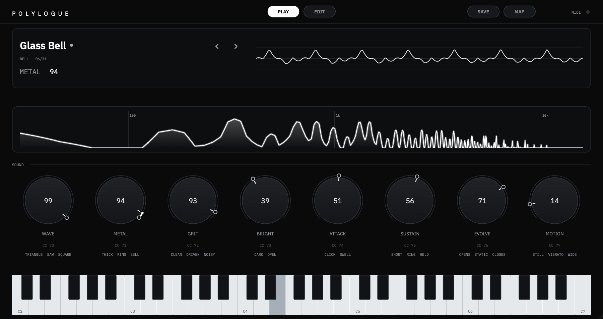
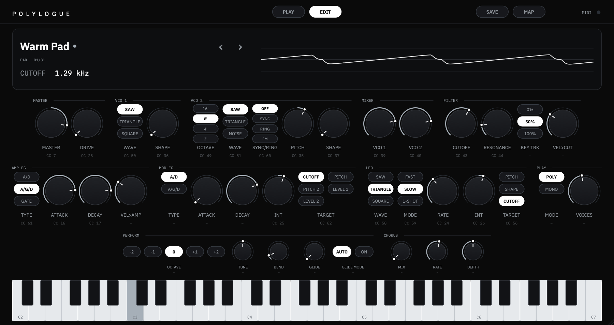
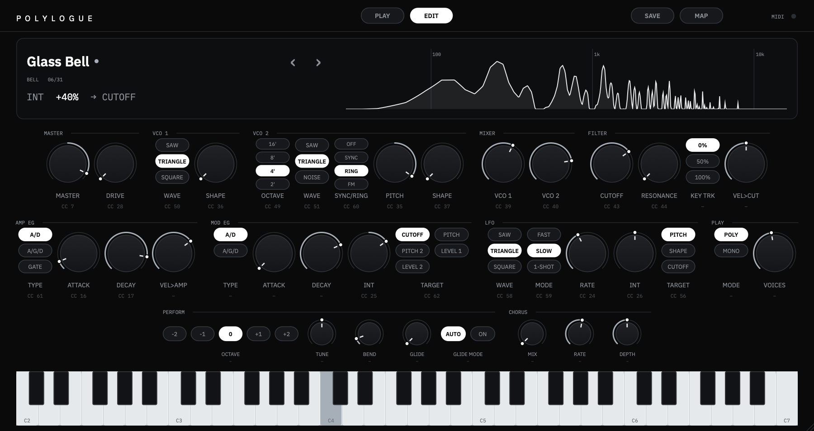
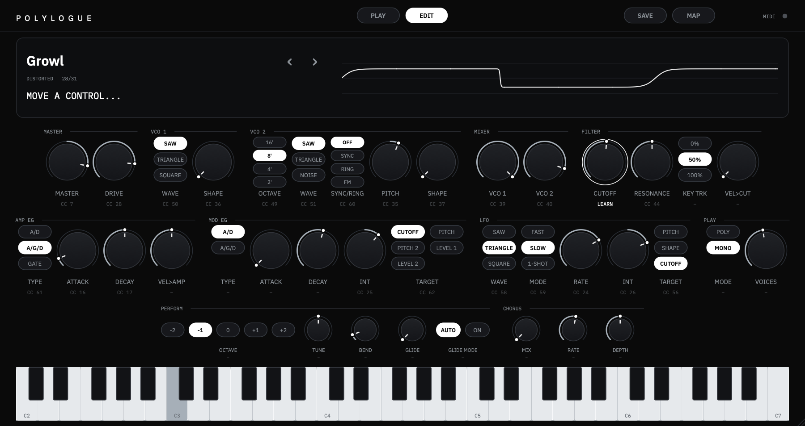

# Polylogue

A polyphonic software synthesizer built on the architecture of a Korg monologue: two oscillators
with sync and ring modulation, a 2-pole low-pass filter with drive, two-stage envelopes and one
LFO. Original branding, interface and sounds; nothing from the hardware is copied.

VST3 and Standalone on macOS, Windows and Linux, plus AU on macOS. C++20, JUCE 8, CMake.

Two screens over one sound. **PLAY** is eight large knobs that describe a sound by how it sounds
(wave, metal, grit, bright, attack, sustain, evolve, motion), with a live spectrum. **EDIT** is the
full panel in the monologue's arrangement: master and drive, two oscillators, mixer, filter, two
envelopes, LFO, chorus and performance settings. Both sit under a display with a visualizer and a
preset browser, above an on-screen keyboard. Every control can be driven and learned from MIDI.




Switching from PLAY to EDIT commits the knobs into the panel's parameters, so you shape a sound
quickly on PLAY and then fine tune it on EDIT. See [docs/play-knobs.md](docs/play-knobs.md).

| Spectrum | MIDI learn |
|:--------:|:----------:|
|  |  |
| Click the visualizer to switch from oscilloscope to spectrum. Here, a ring-modulated bell's inharmonic partials | Press MAP, click any control, move a knob on your controller |

## Install

Grab the zip for your platform from **[Releases](https://github.com/rithulkamesh/polylogue/releases)**:

| Platform | File | Contains |
| --- | --- | --- |
| macOS | `Polylogue-macOS.zip` | AU, VST3 and the standalone app, universal (Apple Silicon and Intel) |
| Windows | `Polylogue-Windows.zip` | `Polylogue.vst3` and `Polylogue.exe` |
| Linux | `Polylogue-Linux.zip` | `Polylogue.vst3` and the `Polylogue` standalone |

On Windows copy the `.vst3` to `C:\Program Files\Common Files\VST3`; on Linux to `~/.vst3`. Then
rescan plugins in your DAW. The Windows and Linux builds are tested in CI but have had less
hands-on use than macOS, so please report anything odd.

### macOS (read this)

Builds are **unsigned and not notarized**: there is no paid Apple Developer Program membership on
this project, so Gatekeeper treats a fresh download as untrusted. That is an Apple policy and cost
constraint, not malware. Nothing phones home.

**Recommended:** the plain bash installer in this repo ([`scripts/install.sh`](scripts/install.sh)).
Read it before piping if you like.

```sh
curl -fsSL https://raw.githubusercontent.com/rithulkamesh/polylogue/master/scripts/install.sh | bash
```

It asks GitHub for the latest release, downloads `Polylogue-macOS.zip`, clears the
`com.apple.quarantine` attribute, ad-hoc signs the bundles (`codesign --force --deep -s -`; a local
signature only, not a Developer ID), and copies them into user paths, with no `sudo`:

- `~/Library/Audio/Plug-Ins/Components/Polylogue.component`
- `~/Library/Audio/Plug-Ins/VST3/Polylogue.vst3`
- `~/Applications/Polylogue.app`

**Manual:** download the zip, then right-click **Open** on each bundle (or allow it under
**System Settings > Privacy & Security**), and copy the AU and VST3 into the folders above.
Rescan plugins in your DAW afterwards.

## Build

Needs CMake 3.25+, Ninja, and a C++20 compiler (Xcode command line tools, Visual Studio 2022, or
GCC/Clang with the JUCE Linux dependencies). Configure fetches JUCE and Catch2.

```sh
make test        # Release build of everything, then the whole test suite
make run         # open the standalone app
make help        # every target: sanitizers, install, dist, screenshots, ...
```

or directly:

```sh
cmake --preset release
cmake --build --preset release
ctest --test-dir build/release --output-on-failure
```

On Linux install `libasound2-dev libx11-dev libxext-dev libxrandr-dev libxinerama-dev
libxcursor-dev libfreetype-dev libfontconfig1-dev libgl1-mesa-dev` first. On Windows use
`cmake -B build && cmake --build build --config Release`.

The plugins land in `build/release/src/plugin/Polylogue_artefacts/Release/{VST3,AU,Standalone}`.
To install them into `~/Library` after building, configure with `-DPOLYLOGUE_COPY_PLUGINS=ON`.

Presets: `dev` (Debug), `sanitize` (ASan + UBSan, no plugin bundles), `tsan` (ThreadSanitizer),
`release`. `-DFETCHCONTENT_SOURCE_DIR_JUCE=/path/to/JUCE` reuses a local JUCE checkout.

## Playing

- **Notes, velocity, pitch bend, sustain** come from any MIDI keyboard. In the standalone app,
  choose the device under *Options*.
- **Presets:** click the name on the display to browse by category, use `‹ ›` or the mouse wheel to
  step through them. 31 factory sounds: pads, bells, gongs, basses, leads, plucks, ambient,
  distorted, keys. Each opens with its play knobs at a sensible spot to turn from.
- **PLAY and EDIT:** the buttons at the top switch screens with a crossfade. On PLAY the ring
  around each knob shows what you have changed from the sound's starting point (a hollow dot is
  where it started).
- **Saving:** **SAVE** (or *Save As...* in the preset menu) stores the current sound under a name.
  Saved sounds appear under *User* and live in `~/Library/Application Support/Polylogue/Presets`.
  A dot after the name means the sound was edited since it was loaded.
- **The visualizer** shows the output as a triggered oscilloscope. Click it for a spectrum.

## MIDI controller mapping

Controls answer to the monologue's own controller chart by default (attack 16, decay 17, LFO rate
24, EG int 25, LFO int 26, drive 28, VCO 2 pitch 35, shapes 36/37, levels 39/40, cutoff 43,
resonance 44, octave 49, waves 50/51, LFO target/wave/mode 56/58/59, sync/ring 60, EG type/target
61/62, master level 7), so a controller set up for a monologue works unchanged. The eight PLAY
knobs answer to CC 70 to 77. Every control shows its CC beneath it. To use your own controller:

1. Press **MAP** and click any control, knob or switch (or right-click it and choose *MIDI Learn*).
2. Move a control on your hardware. It is bound, and the label under the knob shows `CC n`.

Right-click a knob to clear its mapping or restore the defaults. The mapping is saved with your
session and also on this machine (`~/Library/Application Support/Polylogue/midi-map.xml`), so it
survives new instances, and changing presets never unmaps your controller.

Every parameter is automatable from your DAW.

## The EDIT panel

| Section | Controls |
| --- | --- |
| MASTER | Level, drive |
| VCO 1 | Wave (saw, triangle, square), shape |
| VCO 2 | Octave (16' - 2'), wave (saw, triangle, noise), sync/ring, pitch (fine near the centre, up to +/-1200 cents), shape |
| MIXER | VCO 1 and VCO 2 levels |
| FILTER | Cutoff, resonance (the top of the range self-oscillates), key tracking, velocity to cutoff |
| AMP EG | Type (A/D, A/G/D, gate), attack, decay (release for A/G/D), velocity to amp |
| MOD EG | Type, attack, decay, INT (bipolar), target (cutoff, pitch, pitch 2) |
| LFO | Wave, mode (fast, slow, one-shot), rate, INT (bipolar), target (pitch, shape, cutoff) |
| PLAY | Poly or mono, voices (1-16) |
| Below | Octave, tune, pitch-bend range, glide time, glide mode (auto or always) |

Unlike the monologue there are two independent envelopes, one for the amp and one for the filter
or pitch, because the voices are polyphonic. In mono mode with glide on, overlapping notes slide
without retriggering, as on the monologue.

## Tools

```sh
polylogue-render --list                       # every preset: peak, loudness, tail length
polylogue-render --preset "Glass Bell" --notes 48,55 --hold 2 --seconds 8 --out bell.wav
polylogue-benchmark                           # CPU per scenario (use a Release build)
polylogue-fit                                 # how well the eight play knobs reproduce each preset
polylogue-screenshot --preset "Tam Tam" --out editor.png [--spectrum] [--map] [--touch CUTOFF]
```

## Development

- [`docs/architecture.md`](docs/architecture.md) describes the design, the research behind it, and
  how each real-time rule is checked. [`docs/play-knobs.md`](docs/play-knobs.md) covers the PLAY
  screen and how well eight knobs cover the sounds. [`docs/monologue-research.md`](docs/monologue-research.md)
  records what is publicly known about the hardware. See also [`CHANGELOG.md`](CHANGELOG.md).
- `scripts/format.sh` formats the code (K&R braces, 4 spaces, 100 columns; needs `clang-format`).
  `scripts/format.sh --check` verifies without changing files.
- The DSP (`src/dsp`) has no JUCE dependency and is tested offline; `src/host` is the JUCE
  processor layer; `src/ui` is the interface. Tests: `tests/dsp` and `tests/host`.
- The audio thread never allocates or locks. The tests prove the first with a counting allocator
  and check the second with ThreadSanitizer (`cmake --preset tsan`).

## Not built yet

The monologue's step sequencer and motion lanes, and tempo-synced LFO. The engine has room for
them, but the panel has no step editor yet. See `docs/architecture.md` section 5.6.

## Licence

[AGPL-3.0](LICENSE). JUCE is AGPLv3 for open source, so this project is too.
IBM Plex fonts (`assets/fonts`) are under the SIL Open Font License; see `assets/fonts/OFL-LICENSE.txt`.
