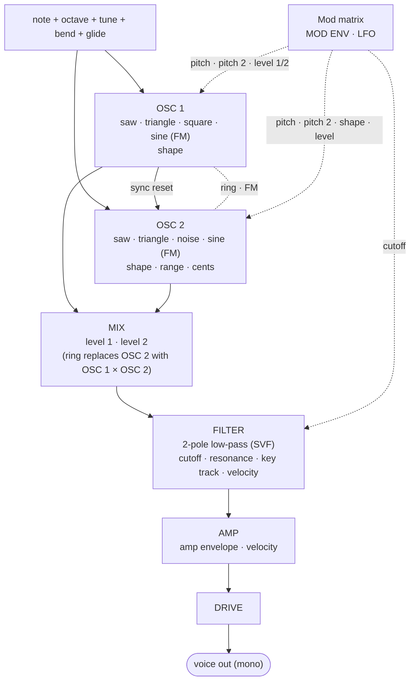
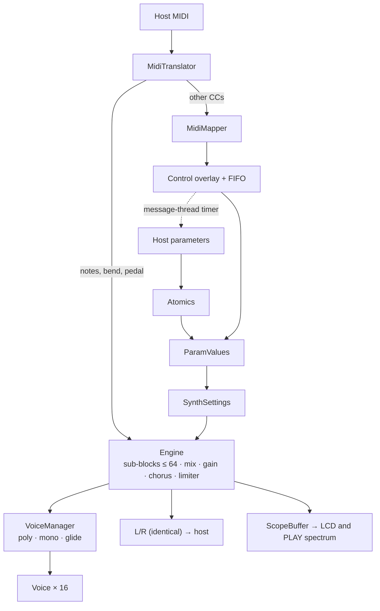
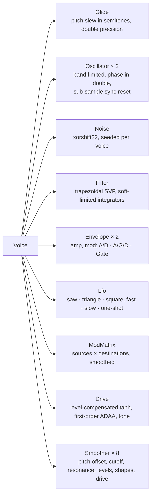
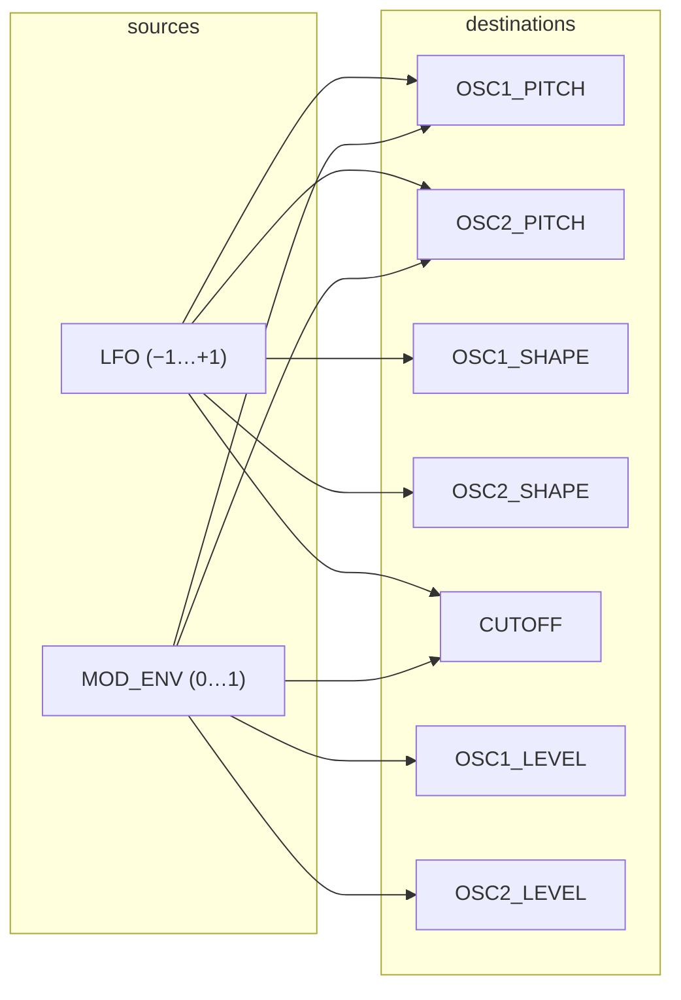
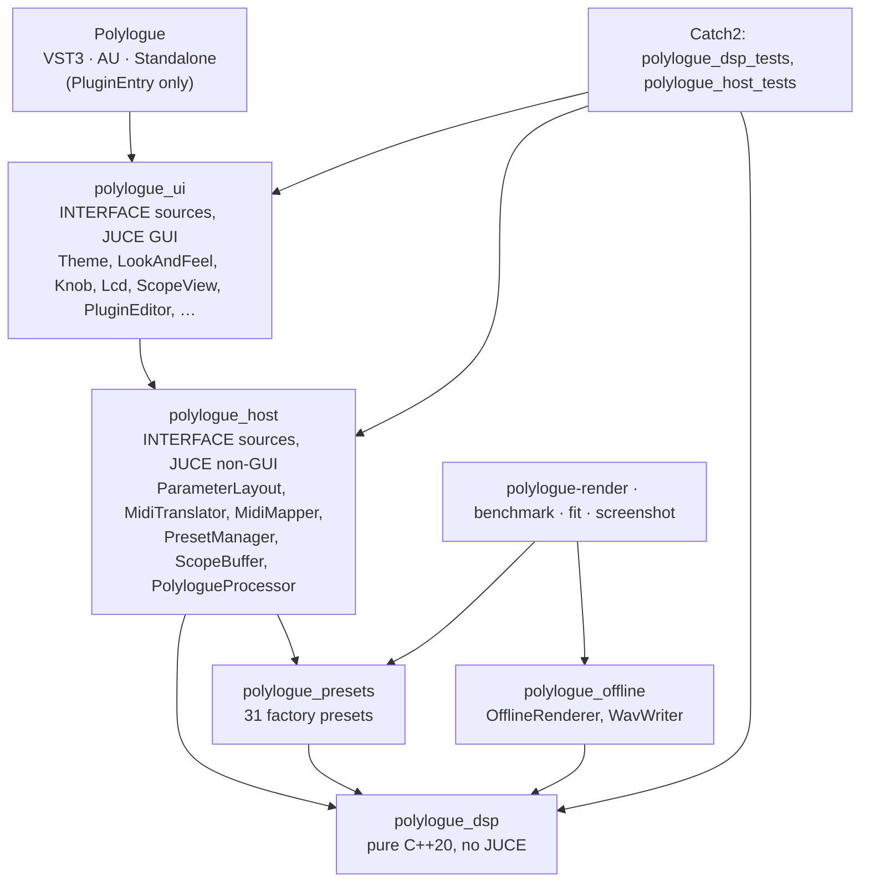

# Polylogue — Architecture

Polylogue is a polyphonic software synthesizer built around the *architecture and workflow* of a
Korg monologue: two oscillators, a small mixer, a 2-pole low-pass filter with a drive stage and a
two-stage envelope and one LFO. It is not a hardware clone. Branding, UI and presets are original.

**Product direction.** The **EDIT** panel follows the monologue's arrangement (master and drive,
the oscillators, mixer, filter, envelopes, LFO) in the visual language of the sibling `chorale`
project, with an LCD, a visualizer, a preset browser and an on-screen keyboard. The **PLAY** screen
is eight large macro knobs, each assigned from the panel to one parameter. An early eight-knob-only
interface hid too much of the sound, which is why the full panel exists; PLAY is a second view of
the same parameters, not a replacement. The
sequencer and motion lanes of the original brief are still deferred (§5.6).

Status: all nine implementation phases (§11) are complete. This document describes what is built.

This document is the contract for the implementation. Section 1 records what is publicly
documented about the monologue and how each item is treated; the remaining sections describe what
we build.

## 1. Research: the monologue's documented architecture

### 1.1 Sources

- Korg, *monologue Owner's Manual* (E2, published 6/2019): block diagram (p.3), VCO/MIXER/FILTER/EG/LFO
  parameter pages (p.15–21), sequencer (p.22–28), edit-mode parameters (p.30–36), MIDI
  implementation chart (p.58).
- Korg *monologue MIDI Implementation* chart, as summarised by
  [midi.guide](https://midi.guide/d/korg/monologue/) (CC assignments).
- Sound On Sound, [*Korg Monologue* review](https://www.soundonsound.com/reviews/korg-monologue).
- Synth Anatomy, [*KORG Monologue review*, p.2](https://synthanatomy.com/2017/10/korg-monologue-analog-monophonic-synthesizer-review.html/2).

No Korg source, firmware, artwork or presets were consulted or used.

### 1.2 Confidence legend

| Tag | Meaning |
| --- | --- |
| **DOC** | Stated in the manual or MIDI chart. Reproduced faithfully. |
| **REV** | Stated by a reviewer who measured or listened. Reproduced, but softer. |
| **APPROX** | Not documented. Our own reasonable DSP approximation. |
| **UNKNOWABLE** | Depends on the proprietary analog design or firmware. We pick a musical default. |
| **DEVIATION** | Deliberately different from the monologue because Polylogue is polyphonic. |

### 1.3 Findings, item by item

**1. Oscillator architecture.** Two VCOs. VCO 1 pitch is locked to the main five-way keyboard OCTAVE
switch (±2 octaves); VCO 2 has its own octave and cent-level pitch. VCO 2 can hard-sync to VCO 1 or
ring-modulate with it (one three-way switch, centre = off). *DOC*.

**2. Waveforms.** VCO 1: saw, triangle, square. VCO 2: saw, triangle, noise. Each oscillator has a SHAPE
knob (0…1023) that "determines the final shape, complexity, or duty-cycle (Square)". Noise has no
shape. *DOC*. Reviewers confirm that on square, SHAPE is pulse-width and at maximum the pulse
practically vanishes *REV*. The exact SHAPE curves for saw and triangle are not published
*UNKNOWABLE*; see §5.1 for ours *APPROX*.

**3. Tuning / range.** VCO 2 OCTAVE: 16', 8', 4', 2'. VCO 2 PITCH: −1200…+1200 cents in 1-cent steps
(SHIFT = semitone steps). Program tuning ±50 cents. Pitch-bend range 1–12 notes per side. *DOC*.

**4. Mixer.** Two level knobs (VCO 1, VCO 2, 0…1023). Noise is VCO 2's third waveform, so noise level
is VCO 2's level. Block diagram shows ring-mod output taking the place of VCO 2 in the mix. *DOC*.

**5. Filter topology and slope.** "Updated" 2-pole (12 dB/oct) low-pass with resonance, "more bite" than the
minilogue, self-oscillates, bass is preserved at high resonance. Cutoff key tracking is 0/50/100 %
(edit mode). *DOC/REV*. The actual circuit is not published *UNKNOWABLE*.

**6. Filter drive.** A DRIVE knob adds "harmonics and distortion"; reviewers describe a rougher, darker
character up to an "overdriven roar" that does not excessively raise level. *DOC/REV*. In the block
diagram DRIVE sits at the output stage, after the VCA *(read from the diagram)*. Circuit
*UNKNOWABLE*.

**7. Filter envelope.** There is one EG. The TARGET switch sends it to PITCH (both VCOs), PITCH 2 (VCO 2
only) or CUTOFF. INT is bipolar (−511…+511). *DOC*.

**8. Amp envelope.** The same EG also drives the VCA. The TYPE switch selects: **A/D** (attack then decay to
0, ignores note-off; VCA percussive), **A/G/D** (attack, hold while gate is on, decay starts at
note-off; VCA sustains while held) or **GATE** (VCA is a plain gate; the target still gets an A/D
shape). ATTACK and DECAY only; there is no sustain level or separate release. *DOC*. Time
constants are not published *UNKNOWABLE*.

**9. LFO.** One LFO. Waves: saw, triangle, square. Modes: FAST (0.5 Hz – 2.8 kHz), SLOW (0.05 – 28 Hz),
1-SHOT (0.05 – 28 Hz; stops one half-cycle after the note starts, acting as a second envelope).
Tempo sync optional. INT can be negative (inverted saw becomes a ramp). No S&H. Audio-rate FAST mode
is used for FM-like and formant-like timbres. *DOC/REV*.

**10. Modulation routing.** Fixed and small. EG → {pitch, pitch 2, cutoff}. LFO → {pitch (both VCOs), shape
(both VCOs), cutoff}. Velocity → cutoff amount and amp amount (edit mode). Key track → cutoff.
No VCO cross-mod, no mod wheel. *DOC/REV*.

**11. Glide.** Portamento time (Off, 0…127) with mode **Auto** (only when playing legato) or **On**
(always). A separate **Slide** effect is set per sequencer step and uses Slide Time (0–100 %).
*DOC*. Curve shape is not published *UNKNOWABLE*.

**12. Sequencer / motion.** 16 steps; per step: note, gate time, slide on/off, active on/off, motion on/off.
Step length 1–16, step resolution 1/16…1/1, swing ±75 %, default gate time, tempo 10–600 BPM
(knob 56–240). Up to **4 motion lanes**, each recording one knob/switch; parameter locks write one
step. Motion data is stored per program. Key Trigger mode starts and transposes the sequence from
the keyboard, with a hold variant. Sync in/out and MIDI clock. *DOC*.

**13. Key modes.** The monologue is monophonic with last-note priority. It is **multi-trigger** normally
(envelope restarts on every note) and becomes **single-trigger** when portamento is engaged and
notes overlap. *DOC/REV*.

**14. MIDI.** Notes (velocity 1–127), pitch bend, program change 0–99, CCs for panel parameters (16 EG
attack, 17 EG decay, 24 LFO rate, 25 EG int, 26 LFO int, 28 drive, 35 VCO2 pitch, 36/37 shape,
39/40 level, 43 cutoff, 44 resonance, 49 VCO2 octave, 50/51 wave, 56/58/59 LFO
target/wave/mode, 60 sync/ring, 61/62 EG type/target), all-sound-off (120), reset-all-controllers
(121), all-notes-off (123–127), clock and transport. Note-off velocity ignored. *DOC*. The
value-to-position split for switch CCs is not in the chart *UNKNOWABLE*.

**15. Distinctive behaviour that shapes the sound.**

- The EG restarts *from zero* on a new note during release, so a slow attack after a fast note
  produces a gap. *REV*. We restart from zero too, but after a ≈2 ms declick fade (§6.4).
- Drive is level-compensated: it darkens and thickens rather than getting louder. *REV*.
- A/G/D vs A/D vs GATE gives three distinct VCA behaviours from two knobs. *DOC*.
- LFO FAST reaches audio rate on cutoff/shape/pitch, giving FM-like tones. *REV*.
- Pulse SHAPE is PWM, vanishing at 100 %. *REV*.
- Resonance keeps low end and the filter self-oscillates for tuned percussion. *REV*.
- 10-bit control resolution. Smooth sweeps; we use float and smooth every continuous parameter. *REV*.
- Sequencer slides are a portamento *between steps*, independent from the global portamento. *DOC*.

### 1.4 What "polyphonic" changes

| monologue | Polylogue | Tag |
| --- | --- | --- |
| One voice | 1–16 voices (default 8), preallocated | DEVIATION |
| One EG shared by VCA and target | Two independent envelopes: **amp** and **mod** (target/filter) | DEVIATION |
| Analog filter/oscillator drift | None. Voices are numerically identical | DEVIATION |
| Mono out | Stereo out, identical channels (voice pan spread is a later option) | DEVIATION |
| Single LFO | One LFO instance *per voice*, phase reset at note-on | DEVIATION |
| Drive after mono VCA | Drive per voice, after the VCA | DEVIATION |
| Fixed hardware CC map | Host automation of every parameter. CC map is a later option | DEVIATION |

## 2. Signal flow

### 2.1 Per voice



### 2.2 System



## 3. Voice architecture

A `Voice` is a plain value type. It owns every DSP component it needs, holds no pointers to other
voices, allocates nothing, and is driven by `noteOn`, `changeNote`, `noteOff`, `fadeOut`, `render`.



Everything time-varying is evaluated **per sample**, because the monologue's FAST LFO reaches
audio rate on cutoff and shape. Parameters that would otherwise zipper (`cutoff`, `resonance`,
levels, shapes, drive, pitch offset, and every modulation amount) pass through one-pole smoothers
of 4–10 ms inside the voice. Waveform and envelope-type switches apply immediately.

Voice lifecycle: `Idle → Active → Releasing → Idle`, plus a **fade** state: starting a note on an
audible voice fades the old sound out over 2 ms and then starts the new one (§6.4). A voice is
`isActive()` while its amp envelope runs or a fade is in progress.

## 4. Parameters

Single source of truth: `src/dsp/Parameters.{h,cpp}`. A `constexpr` table of `ParamSpec` (stable
string ID, display name, kind, range, default, curve, step, unit, choice labels) indexed by the
`Param` enum. The JUCE layer generates its `AudioProcessorValueTreeState` layout from that table
and reuses the table's own normalise/denormalise/format/parse functions, so DSP and host can
never disagree about a mapping. IDs are **append-only**: renaming or reusing one breaks saved
projects. A test pins the full ID list.

Kinds: `Float` (curves `Linear`, `Exponential`, `Power`, `SymmetricPower`; optional step), `Int`,
`Choice`, `Bool`. The 39 sound parameters are host-automatable; the eight macro assignments are
saved with the sound but hidden from hosts (`ParamSpec::automatable`). A per-block `ParamValues` (plain units)
is converted once into `SynthSettings`, the typed struct the voices read, so DSP modules never
index into the table. A test asserts that the table's defaults reproduce `SynthSettings{}`.

| ID | Name | Kind | Range / choices | Default |
| --- | --- | --- | --- | --- |
| `level` | Level | Float dB | −60 … +6 | 0 |
| `polyphony` | Voices | Int | 1 … 16 | 8 |
| `key_mode` | Key Mode | Choice | Poly, Mono | Poly |
| `octave` | Octave | Int | −2 … +2 | 0 |
| `tune` | Tune (cents) | Float | −50 … +50 | 0 |
| `bend_range` | Bend Range (st) | Int | 1 … 12 | 2 |
| `glide_time` | Glide Time (s) | Float, Power | 0 … 2 (0 = off) | 0 |
| `glide_mode` | Glide Mode | Choice | Auto, On | Auto |
| `drive` | Drive | Float | 0 … 1 | 0 |
| `osc1_wave` | Osc 1 Wave | Choice | Saw, Triangle, Square | Saw |
| `osc1_shape` | Osc 1 Shape | Float | 0 … 1 | 0 |
| `osc2_wave` | Osc 2 Wave | Choice | Saw, Triangle, Noise | Saw |
| `osc2_octave` | Osc 2 Octave | Choice | 16', 8', 4', 2' | 8' |
| `osc2_pitch` | Osc 2 Pitch (cents) | Float, SymmetricPower, step 1 | −1200 … +1200 | 0 |
| `osc2_sync_ring` | Sync / Ring | Choice | Off, Sync, Ring | Off |
| `osc2_shape` | Osc 2 Shape | Float | 0 … 1 | 0 |
| `osc1_level` | Osc 1 Level | Float | 0 … 1 | 1 |
| `osc2_level` | Osc 2 Level | Float | 0 … 1 | 0 |
| `cutoff` | Cutoff (Hz) | Float, Exponential | 20 … 20 000 | 8 000 |
| `resonance` | Resonance | Float | 0 … 1 | 0 |
| `key_track` | Key Track | Choice | 0 %, 50 %, 100 % | 0 % |
| `vel_cutoff` | Velocity → Cutoff | Float | 0 … 1 | 0 |
| `amp_type` | Amp Env Type | Choice | A/D, A/G/D, Gate | A/G/D |
| `amp_attack` | Amp Attack (s) | Float, Exponential | 0.001 … 4 | 0.002 |
| `amp_decay` | Amp Decay (s) | Float, Exponential | 0.005 … 8 | 0.25 |
| `vel_amp` | Velocity → Amp | Float | 0 … 1 | 0.5 |
| `env_type` | Mod Env Type | Choice | A/D, A/G/D | A/D |
| `env_attack` | Mod Attack (s) | Float, Exponential | 0.001 … 4 | 0.001 |
| `env_decay` | Mod Decay (s) | Float, Exponential | 0.005 … 8 | 0.3 |
| `env_int` | Mod Env Int | Float | −1 … +1 | 0 |
| `env_target` | Mod Env Target | Choice | Cutoff, Pitch, Pitch 2 | Cutoff |
| `lfo_wave` | LFO Wave | Choice | Saw, Triangle, Square | Triangle |
| `lfo_mode` | LFO Mode | Choice | Fast, Slow, 1-Shot | Slow |
| `lfo_rate` | LFO Rate | Float | 0 … 1 | 0.4 |
| `lfo_int` | LFO Int | Float | −1 … +1 | 0 |
| `lfo_target` | LFO Target | Choice | Pitch, Shape, Cutoff | Pitch |

**The panel** shows every parameter exactly once (`src/ui/PanelLayout.cpp` lists the sections,
cells and labels, and a test-visible invariant is that adding a parameter means adding it there).
`osc2_pitch` (PITCH) uses a symmetric power curve so the centre of the knob is fine detune (a few
cents) and the extremes reach the ±1200-cent intervals bells and gongs need. INT on the mod
envelope and on the LFO act on whatever the `TARGET` chips say; the display names the target
(`INT +40% → CUTOFF`).

## 5. DSP modules

All in `src/dsp/`, namespace `polylogue::dsp`, no JUCE.

| Module | Responsibility |
| --- | --- |
| `Parameters` | Param table, `ParamValues`, curves, formatting, parsing, `toSettings` |
| `Settings` | Enums and `SynthSettings`, the typed per-block input to the voices |
| `Blep` | Band-limiting residuals for steps and ramps (§5.1) |
| `Oscillator` | Saw/tri/square + shape, hard-sync reset |
| `Noise` | xorshift32 white noise |
| `Filter`, `Saturation` | 2-pole low-pass (§5.2), soft limiting |
| `Drive` | Saturator (§5.3) |
| `Envelope` | Attack/decay, three types (§5.4) |
| `Lfo`, `ModMatrix`, `Glide`, `Smoother` | Modulation (§5.5, §7) |
| `Voice`, `VoiceManager` | One voice; the pool and its policies (§6) |
| `Engine`, `MidiEvent` | Sub-blocking, mixing, limiter; the plain event type |
| `Fft` | Windowed magnitude spectrum for tests and the visualizer |

### 5.1 Oscillators

Phase is a `double` in [0, 1). Frequency comes from `midiToHz(note + offsets)`, so pitch is exact
across the keyboard (tested to 0.05 cent for every waveform, and at 22–192 kHz).

Band-limiting locates each discontinuity to a fraction of a sample and adds a residual to the four
samples around it: the difference between a step (or ramp) smoothed by a **cubic B-spline** kernel
four samples wide and the ideal one (`Blep.h`; derivations are in the header tests). Steps
(saw, pulse) use the step residual, slope changes (triangle) the ramp residual. The corrections
are summed into a four-slot buffer and the output lags the phase by **one sample**. This measured
about 10 dB cleaner than the common two-sample polyBLEP and about 25 dB cleaner than a naive saw
at musical pitches (tests pin the limits).

| Wave | Shape 0 → 1 (**APPROX**) |
| --- | --- |
| Saw | Blends in a phase-offset second saw; ends as an octave-up saw |
| Triangle | Symmetric triangle skewing toward a ramp (rise 0.5 → 0.05) |
| Square | Pulse width 50 % → 2 %, DC removed and peak-normalised |
| Noise (osc 2) | Ignores shape |

**Sync:** OSC 1's wrap resets OSC 2's phase at the exact sub-sample position. The jump beyond what
the waveform's own wrap correction covers is added as an extra step (and slope) event, so sync
stays band-limited. **Ring:** OSC 2's contribution becomes OSC 1 × OSC 2 (the product is not
band-limited; it is already the "harsh, metallic" sound the manual describes). Phases reset to
zero at note-on, so renders are reproducible.

### 5.2 Filter

Trapezoidal (Zavalishin) state-variable filter, low-pass output. Resonance maps to damping
`k = 2 (1 − 1.01 r)`, so the top 1 % of the knob is negative damping and the filter rings on its
own. The integrators pass signal untouched up to ±1 and then soft-limit toward ±2 with a tanh
knee, which bounds self-oscillation without bending the response at nominal levels (a plain tanh
on the states measurably leaked DC gain and was rejected). The response matches the analytic
bilinear-warped 2-pole to 0.15 dB from 250 Hz to 16 kHz. No bass compensation is applied, matching
"bass is preserved". Cutoff is computed per sample in octaves:

```
octaves = log2(cutoff_knob) + modulation(env, lfo) + keyTrack·(note−60)/12 + velCutoff·(vel−1)·4
```
clamped to [5 Hz, 0.45·fs]. **APPROX**: scaling and topology of the original are proprietary.

### 5.3 Drive

`f(x) = r · tanh(g x) / tanh(r g)` with reference level `r = 0.7` and `g = 12 · amount²`. The
curve is transparent as `g → 0` (bit-exact at zero drive) and passes a signal at the reference
level at unity however hard it is driven, which is the "darker and rougher without getting much
louder" behaviour. First-order antiderivative anti-aliasing (`ln cosh`) suppresses aliasing
without oversampling (tested 5 dB below the per-sample curve), followed by a one-pole low-pass
sweeping 20 kHz → 5 kHz with the amount. The stage sits after the VCA, as the block diagram
shows. **APPROX**.

### 5.4 Envelopes

Exponential segments. Attack aims at 1.2 and clamps at 1.0, like an RC charge; decay is a one-pole
to zero with the time measured to −60 dB. An envelope is idle below −80 dB.

| Type | Behaviour |
| --- | --- |
| A/D | Attack → decay to 0. Note-off ignored. |
| A/G/D | Attack → hold at 1 while gated → decay on note-off (from wherever it is). |
| Gate | 1 ms attack and decay, i.e. a gate. |

Restart resets to zero (§1.3, item 15); the voice-level fade (§6.4) keeps that click-free.

### 5.5 LFO

Wraps an `Oscillator`, so audio-rate modulation is band-limited. Rate is a 0–1 knob mapped
exponentially: FAST 0.5 Hz–2.8 kHz, SLOW and 1-SHOT 0.05–28 Hz (tested against the manual's
figures). Every wave starts at phase 0 at note-on. 1-SHOT runs half a cycle then holds its last
value, so it works as a second envelope. Tempo sync is deferred with the sequencer (§5.6).

### 5.6 Sequencer (deferred)

The monologue's 16-step sequencer, motion lanes, slides and key-trigger are documented in §1.3
item 12 but **not built**: it needs a step editor the panel does not yet have. The engine leaves room:
sequencer notes would enter through the same `MidiEvent` path as the keyboard, and a slide is a
note-on that joins the previous voice (`Voice::changeNote`, already used by mono mode).

## 6. Polyphony strategy

### 6.1 Capacity and limit

`kMaxVoices = 16` is a compile-time capacity: `std::array<Slot, 16>` inside `VoiceManager`,
nothing else. The active limit (`polyphony`, default 8) is runtime. Raising capacity is one
constant. Lowering the limit fades the excess voices out.

### 6.2 Allocation order (poly)

1. A voice already playing **the same note** (held or still releasing) → retrigger it.
2. An **idle** voice (lowest index).
3. Steal a **releasing** voice: the quietest.
4. Steal the **oldest held** voice.

### 6.3 Sustain, note-off, velocity

- Note-off with the pedal down marks the voice `sustained`; pedal up releases all of them.
- Note-on with velocity 0 is note-off (translator level).
- Velocity is stored per voice at note-on and applied to amp and cutoff via `vel_amp` /
  `vel_cutoff`.
- All-notes-off releases; all-sound-off fades everything out over 2 ms.

### 6.4 Stealing and retrigger without clicks

Starting a note on an audible voice fades it to zero over 2 ms, then resets it and starts the
pending note. A note-off that arrives during the fade is remembered and applied right after the
start. The new note therefore begins ≈ 2 ms late but click-free.

### 6.5 Mono key mode and glide

`key_mode = Mono` uses one voice, last-note priority and a note stack: releasing the top key
returns to the key below it. Envelopes retrigger on every note, except when glide is on and the
notes overlap, which is **single trigger** (the monologue rule): the pitch slides and the
envelopes keep going. Glide `Auto` applies only to overlapping notes, `On` to every note. In
poly mode each new voice starts its pitch from the most recently played note under the same rule.
Changing key mode releases everything held.

## 7. Modulation matrix

A dense table of smoothed amounts, `[source][destination]`, evaluated per sample.



Amounts are in destination units (semitones, shape 0…1, octaves). `configure(settings)` writes
the panel's target switches into the table each block; switching a target crossfades over 10 ms
(the old route fades out while the new one fades in) instead of clicking.

| Panel control | Amounts at full knob |
| --- | --- |
| `env_target = Cutoff` | MOD_ENV → CUTOFF: `env_int · 8 oct` |
| `env_target = Pitch` | MOD_ENV → OSC1, OSC2 pitch: `env_int² · sign · 48 st` |
| `env_target = Pitch 2` | MOD_ENV → OSC2 pitch: same amount |
| `lfo_target = Pitch` | LFO → OSC1, OSC2 pitch: `lfo_int² · sign · 12 st` |
| `lfo_target = Shape` | LFO → OSC1, OSC2 shape: `lfo_int · 0.5` |
| `lfo_target = Cutoff` | LFO → CUTOFF: `lfo_int² · sign · 6 oct` |

Per-note constants (key track, velocity) are not modulation and are folded into the voice at
note-on. Adding a source (mod wheel, aftertouch) or a destination (resonance, drive) means one
enum entry and one row in `configure`.

## 8. Threading and real-time constraints

| Thread | Does | Must not |
| --- | --- | --- |
| **Audio** | `processBlock`: read atomics, translate MIDI, run `Engine` | allocate, lock, log, touch files, wait, throw |
| **Message/UI** | Edit parameters (via the host layer), load/save presets, MIDI-learn, paint | run DSP |
| **Host** | Automation (atomics), state save/load | — |

How the rules are met, and how they are checked:

- **No allocation.** Voices, the event and control arrays, and every buffer are members sized at
  construction. `prepare` never allocates either. *Checked:* a counting `operator new` in the test
  binary proves `Engine::process` (all 31 presets, with notes, bend, pedal, all-notes-off) and
  `PolylogueProcessor::processBlock` (with CC traffic) allocate **zero** times. The guard is
  disabled under AddressSanitizer, so run it in the `dev` or `release` build; a meta-test proves
  the guard can see allocations.
- **No locks.** UI → audio through `std::atomic<float>` (parameter values), atomics (`MidiMapper`),
  and a lock-free ring (`ScopeBuffer`). Audio → UI through `juce::AbstractFifo`. *Checked:* a
  stress test runs audio while another thread hammers parameters, presets, state, and MIDI
  mapping under **ThreadSanitizer** (the `tsan` preset): no races.
- **Parameter changes.** The audio thread copies each value once per block. Continuous ones are
  smoothed per sample inside the voices; a step test proves none of level, oscillator levels,
  drive, cutoff, resonance, shape or pitch bend clicks.
- **Controller-driven knobs.** The audio thread applies a mapped CC to a local overlay (so the sound
  follows at once) and pushes `{knob, value}` to the FIFO. A message-thread timer drains it with
  `setValueNotifyingHost`, so the UI moves and the host can record automation. The overlay drops
  once the parameter reflects the value, or after 0.5 s.
- **Presets/state.** Applied on the message thread by setting parameters. The audio thread never
  parses XML or touches files.
- **Denormals.** `juce::ScopedNoDenormals` in `processBlock`.
- **Determinism.** Noise uses a seeded PRNG and oscillator phases reset at note-on, so offline
  renders are reproducible; a test shows output is bit-identical for any host block size from 1 to
  4096.
- **Sub-blocks.** MIDI events split the block at their sample offset; sub-blocks are ≤ 64 samples.
  Events beyond the fixed capacity (2048 per block) are dropped rather than allocating.

## 9. Plugin architecture



JUCE-facing code is an `INTERFACE` source library so each consumer (plugin, tests, screenshot
tool) compiles JUCE once; strict warnings are attached to our own files only, never to JUCE's.
Dependencies point down: `Polylogue → ui → host → dsp`. `dsp` includes no JUCE. The processor
creates its editor through an injected factory, so `host` never depends on `ui`.

- **Parameters:** `createParameterLayout` walks the table, creating `AudioParameterFloat/Int/
  Choice/Bool` with stable IDs (`ParameterID{id, kParameterVersion}`), custom range lambdas from the
  table's own curves, and text conversion in both directions.
- **State:** `getStateInformation` writes one XML document: version, preset name, whether it was
  edited since load, every parameter's plain value by ID, and the MIDI map. Restore starts from
  the defaults, applies whatever the document names (clamped, unknown IDs ignored), so loading
  is deterministic however old the session is. Garbage input is rejected without side effects.
- **MIDI:** `translateMidi` converts a `juce::MidiBuffer` to `dsp::MidiEvent` (any channel, note
  on/off, velocity-0 note-off, pitch bend, CC 64, CC 120/121/123–127) and hands every other CC
  back for routing. It allocates nothing and drops overflow.
- **MIDI mapping:** `MidiMapper` has a slot per parameter, so every control on the panel, knob or
  switch, can be driven from hardware. Defaults are the monologue's own controller chart (16 attack,
  17 decay, 24 LFO rate, 25 EG int, 26 LFO int, 28 drive, 35 VCO 2 pitch, 36/37 shapes, 39/40 levels,
  43 cutoff, 44 resonance, 49 VCO 2 octave, 50/51 waves, 56/58/59 LFO target/wave/mode, 60 sync/ring,
  61 EG type, 62 EG target) plus CC 7 for level, so a controller set up for a monologue works
  unchanged. The monologue's single EG maps to the *amp* envelope here (attack, decay, type);
  INT and TARGET map to the mod envelope. Continuous controls follow the parameter's curve;
  switches and integers split 0–127 into equal bands. Learn: right-click any control →
  *MIDI Learn*, or press **MAP** and click a control; the next CC that arrives is bound, and map
  mode ends. CC 0, 32, 64 and 120–127 keep their standard meaning and cannot be bound. Binding a
  CC that another control owns moves it. The map lives in the session and is mirrored to
  `~/Library/Application Support/Polylogue/midi-map.xml` (one `<Bind id cc>` per parameter), which
  wins on load so a new instance keeps the user's controller setup.
- **Macros:** eight hidden integer parameters (`macro1`–`macro8`) each holding the index of the
  parameter it moves. A PLAY knob is an ordinary `Knob` on that parameter, so the engine, MIDI map
  and automation are unchanged. Right-click a control on EDIT to assign it
  (`PolylogueProcessor::assignMacro`); the editor rebuilds the knob when the assignment changes.
- **Presets:** 31 factory presets as `constexpr` tables of overrides on the defaults, in nine
  categories (Pad, Bell, Gong, Bass, Lead, Pluck, Ambient, Distorted, Keys), loudness-matched with
  `polylogue-render --list` to within 2.4 dB of each other (Wind, capped by the +6 dB level range,
  sits 3.5 dB below the loudest). Loading is deterministic. User presets are XML in `~/Library/Application Support/Polylogue/Presets/`;
  damaged files are skipped. The MIDI map is deliberately not part of a preset. Presets are also
  the host's programs.
- **UI (chorale's language):** near-black canvas, IBM Plex (embedded, OFL), white ink, one neutral
  accent, chorale's knob (rim, pointer, 1 px track, 2 px arc, dot) and pill chips for switches. An
  **LCD** on top (preset name and category, prev/next, the last control touched with its value
  and target, MIDI-learn prompts, and a visualizer), then the panel in the monologue's order
  (the **EDIT** screen; row 1: MASTER, VCO 1, VCO 2, MIXER, FILTER; row 2: AMP EG, MOD EG, LFO, PLAY; then octave, tune,
  bend range, glide) with a label and its CC under every control, then an on-screen keyboard
  (C2–C7, a `MidiKeyboardComponent` restyled to the panel). Four small buttons: **PLAY** / **EDIT** and **SAVE** / **MAP**, and a MIDI activity light. PLAY
  replaces the panel with a live spectrum and the eight macro knobs; the two screens crossfade, and
  every knob glides to new values instead of jumping. Keys played on screen reach the audio thread through a
  lock-free FIFO; MIDI notes come back through another so a hardware keyboard lights the keys. The visualizer is an
  oscilloscope with a rising-edge trigger and auto-gain, or a spectrum; click to switch. Clicking
  the preset name opens a categorised menu (with *Save As* and *Delete*); the mouse wheel steps
  through presets. Anything that moves a control (mouse, automation, a controller) shows up in the
  LCD. The window is resizable at a fixed aspect ratio.
- **Formats:** VST3, AU (macOS), Standalone, on macOS, Windows and Linux. Standalone keeps its last state between
  launches (JUCE's wrapper persists it) and offers MIDI device selection.

## 10. Build, quality, tooling

- CMake ≥ 3.25, Ninja, C++20, JUCE 8.0.15 and Catch2 3.16 pinned via `FetchContent`. Configure
  fetches them; `-DFETCHCONTENT_SOURCE_DIR_JUCE=<path>` reuses a local checkout.
- Presets (`cmake --preset <name>`): `dev` (Debug, everything), `sanitize` (Debug + ASan + UBSan,
  no plugin bundles), `tsan` (Debug + ThreadSanitizer), `release`. Plugins are not copied into
  `~/Library` unless `-DPOLYLOGUE_COPY_PLUGINS=ON`.
- Warnings on our targets: `-Wall -Wextra -Wpedantic -Wconversion -Wsign-conversion -Wshadow
  -Wnon-virtual-dtor -Wold-style-cast -Woverloaded-virtual -Wnull-dereference -Wdouble-promotion
  -Wimplicit-fallthrough -Werror`. Not applied to JUCE: pure targets link `polylogue_options`;
  JUCE-facing sources get the same flags as per-file properties.
- `.clang-format`: K&R (function bodies open on their own line, every other brace attaches),
  4-space indent, 100 columns; `scripts/format.sh [--check]`. `.editorconfig` for editors.
- CI: `.github/workflows/build.yml` runs as parallel jobs: format check, ASan/UBSan and TSan on
  Linux, and a Release build with the full test suite on macOS, Linux and Windows (MSVC warnings at
  `/W4 /WX`). Concurrent runs of a branch cancel each other. `release.yml` builds, tests and packages
  all three platforms on a `v*` tag.

## 11. Implementation phases

| # | Phase | Result |
| --- | --- | --- |
| 1 | Research + this document | Done |
| 2 | Build skeleton | Done: dsp lib, tests, VST3/AU/Standalone from a fresh configure |
| 3 | One mono voice | Done: oscillators, filter, envelopes, offline WAV |
| 4 | Voice manager | Done: poly, stealing, sustain, retrigger, velocity, sample-accurate engine |
| 5 | Modulation, LFO, drive, glide, mono | Done. Sequencer deferred (§5.6) |
| 6 | Parameters, state, presets, MIDI | Done: table-driven, 31 presets, learnable CC map |
| 7 | UI | Done: LCD, full panel, visualizer, keyboard, preset menu, save, map |
| 8 | Tests, profiling, cleanup | Done: see §13 |
| 9 | PLAY screen | Done: eight macro knobs, each assigned to one panel parameter |

## 12. Decisions log

| Decision | Choice | Why |
| --- | --- | --- |
| Envelope split | Separate amp and mod envelopes | Requested; the shared monologue EG makes no sense polyphonically |
| Modulation rate | Per sample | FAST LFO is audio rate; cost is small (§13) |
| Filter | Trapezoidal SVF, knee-limited states | Stable under fast modulation, self-oscillates, exact response |
| Anti-aliasing | 4-sample B-spline residuals + ADAA | No oversampler to maintain; measurably better than 2-sample polyBLEP |
| Oscillator latency | One sample | Lets every discontinuity, including sync, use one mechanism |
| Drive location | Per voice, post-VCA | Matches the diagram; avoids inter-voice intermodulation |
| Front panel | The monologue's controls, every parameter shown once | Eight knobs hid too much of the sound to shape it |
| Sequencer | Deferred | No UI surface on the requested panel; engine keeps the hook |
| CC mapping | Every control learnable; defaults are the monologue's chart | Monologue-ready controllers work unchanged; learn covers the rest |
| Presets vs MIDI map | Map is global, not in presets | Sound changes must not unmap the controller |
| Test framework | Catch2 v3 (test targets only) | Standard, readable failures; never linked into the plugin |
| JUCE consumption | INTERFACE source libraries | Avoids duplicated module code and keeps `-Werror` off JUCE |
| Voice capacity | 16 compile-time, runtime limit | Keeps "no allocation"; growth is one constant |
| Level default | 0 dB | The engine already reserves headroom (0.35 and a soft limiter) |
| Mod wheel / aftertouch | Deferred | Not on the monologue; the matrix has room |
| Eight play knobs | Macros: each is assigned to one parameter from EDIT | A knob that moved many parameters at once felt random; a macro moves exactly what you chose |
| Platforms | macOS, Linux and Windows in CI and releases | The DSP is portable; only the JUCE layer needed platform care |

## 13. Verification and measured performance

Automated (`ctest --preset dev`; the `sanitize` and `tsan` presets run the same tests):

| Area | What is proven |
| --- | --- |
| Oscillators | Pitch within 0.05 cent for every wave across the keyboard; bounded, DC-free at every shape; exact periodicity; aliasing limits vs a naive reference; sync locks to the master period; residual kernels are odd/even, continuous and integrate correctly |
| Envelopes | Attack time, monotonic rise, A/D vs A/G/D vs Gate, release −60 dB timing, restart from zero |
| Filter | Matches the analytic warped response to 0.15 dB; unity DC; resonance peak and kept bass; finite and bounded over the full parameter cube and under audio-rate cutoff modulation; self-oscillation only at the top |
| Drive, LFO, glide, matrix | Transparent at zero; bounded peak; odd symmetry; ADAA gain; documented LFO ranges; one-shot; glide timing; every routing |
| Voices | Allocation order, retrigger, stealing policy, sustain, limit changes, click-free hand-over, mono stack, single-trigger, glide modes, 150 random patches |
| Engine | Sample-exact note starts; identical output for host block sizes 1–4096; bend; pedal; limiter; polyphony limit; 128 notes × velocities × 2 rates; 3-second random MIDI floods |
| Sample rates | 22.05–192 kHz: every preset renders finite and unclipped; pitch exact |
| Parameters | Stable IDs, ranges, curves, formatting and parsing round trips; defaults ⇒ default settings |
| Presets | 31 legal, unique, loud enough, loudness-matched, finite, terminating; categories behave (plucks die, gongs ring, pads swell) |
| Macros | Assignment persists with the session and does not change the sound; a PLAY knob follows its assignment |
| Host | Layout ↔ table; state round trip, forward/backward compatibility, garbage rejection; MIDI translation; controller map, learn, persistence; CC → knob → parameter; presets (factory, user, damaged); programs |
| Real-time | Zero allocations on the audio path; no data races (TSan) |
| UI | Editor constructs, lays out, and paints at every size, for every preset, in every visualizer state, on both screens |

Measured on Apple Silicon, Release, 48 kHz, 512-sample blocks (`polylogue-benchmark`), share of
one core:

| Scenario | CPU |
| --- | --- |
| Idle | 0.04 % |
| 1 voice, pad | 0.5 % |
| 8 voices, pad | 2.7 % |
| 16 voices, pad | 5.4 % |
| 16 voices, growl (drive + LFO on cutoff) | 8.6 % |
| 16 voices, sync lead with drive | 9.0 % |

Per-sample modulation, per-voice drive and full band-limiting are affordable, so no shortcut was
taken.
