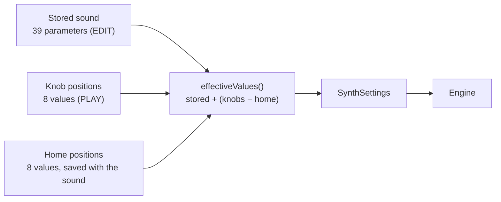
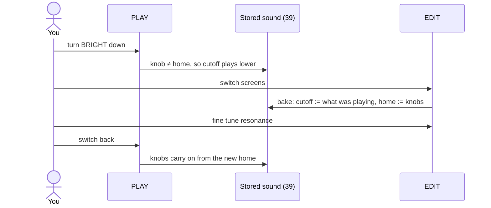
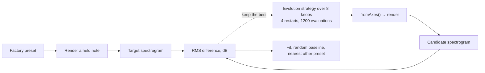

# The play knobs

Polylogue has two ways to shape a sound. **EDIT** is the full panel, one control per parameter,
like the hardware. **PLAY** is eight large knobs that describe a sound in terms of what you hear
rather than what the oscillators and filter are doing. Both control the same sound, and you can
move between them at any time.

## The eight knobs

Each knob passes through different kinds of sound as it turns; it is not one parameter rescaled.
Default MIDI controllers are CC 70 to 77, in this order.

| Knob | Low → high | What it drives |
| --- | --- | --- |
| **WAVE** | triangle → saw → square | Oscillator 1 waveform and shape |
| **METAL** | thick, harmonic → sync growl → ring → FM bell | Oscillator 2 level and pitch, sync, ring and FM modulation |
| **GRIT** | clean → driven → resonant and noisy | Drive, resonance, and noise from oscillator 2 when it is free |
| **BRIGHT** | dark → open | Filter cutoff (with key tracking and velocity) |
| **ATTACK** | hard click → slow swell | Amp and mod envelope attack |
| **SUSTAIN** | short hit → long ring → held | Amp envelope type, decay and release |
| **EVOLVE** | opens over time ← static → closes over time | Mod envelope amount and direction; its target is the cutoff, or the FM index once METAL is in FM |
| **MOTION** | still → vibrato → wobble → wide | LFO target, rate and depth, and chorus |

METAL is the widest knob. Its low third adds a second, slightly detuned oscillator, the middle
turns on hard sync and then ring modulation with a sweeping ratio, and the top hands over to
two-operator FM with the ratio and index moving together, which is where bells and gongs live.

## How PLAY and EDIT stay in step

The sound is stored as the 39 sound parameters that EDIT shows. Each PLAY knob has two values
saved with the sound: where the knob is, and its **home**, where it was when the sound was made.
The engine plays the stored sound moved by however far each knob is from home:

This gives three properties:

- **A preset sounds exactly as it was made.** Every factory preset has its knobs at home, so the
  offset is zero and the stored sound is played untouched.
- **Fine tuning survives.** If you set a cutoff by hand in EDIT, BRIGHT moves it up or down from
  where you put it, by the same amount as on an untouched sound.
- **It is automation-safe.** The result depends only on the current values, never on the order the
  knobs were turned, so automation and MIDI give the same sound every time.

Switching from PLAY to EDIT **bakes** the sound: the offsets are written into the 39 parameters and
home moves to the knob positions. EDIT then shows the sound as it is playing, ready to fine tune,
and the knobs carry on from there.

Switches follow the knob rather than shift: crossing into FM changes the sync mode to FM, and
crossing back restores it. Oscillator 2's range switch and fine tune move together as one pitch.

## Factory presets

Each of the 31 presets stores its own home position, found by search rather than by hand, so the
knobs sit on the sound's nearest point in the eight-knob space and every preset opens with a
meaningful spread to turn. User presets store their own home the same way.

## How well eight knobs cover the sounds

`polylogue-fit` measures this. For each preset it renders a held note, searches the eight knobs
for the closest-sounding position, and compares the two by log-spectrogram (40 bands over 16
frames, RMS difference in dB). It reports the fit next to two yardsticks: the same search budget
spent on random positions, and the distance to the most similar other factory preset.

Results for the current mapping, 1200 evaluations per preset:

| | Median | Worst |
| --- | --- | --- |
| Best eight-knob position | **6.0 dB** | 12.0 dB (Synclavier Gong) |
| Random positions, same budget | 9.8 dB | |
| Most similar other preset | 13.5 dB | |

All 31 presets are reproduced more closely than the most similar other preset is. Basses, leads,
pads, plucks and distorted sounds land within about 3 to 6 dB; the hardest are the FM and shimmer
sounds (Synclavier Gong, Glass Bell, Shimmer, Kalimba, Wind).

What this does and does not show. It shows the eight knobs span the character of the factory sounds
in gross spectrum and timing, not that they reproduce any sound exactly: 6 dB is the same kind of
sound, not the same sound, and the comparison cannot resolve partial pitches finely or judge stereo
width. EDIT exists for everything the knobs cannot reach. Known limits of the mapping:

- Oscillator 1 has no sine wave of its own, so a pure sine only appears as the FM carrier, and WAVE
  has no effect once METAL is in FM.
- The one-shot LFO and the noise-with-FM combination are not reachable from the knobs.
- The knobs do not compensate loudness; BRIGHT down is quieter, as with a filter.

Regenerate the home positions after changing the mapping with `make fit`, then commit the resulting
`src/presets/FactoryAxes.inc`. To listen to original and eight-knob versions side by side, run
`polylogue-fit --wav DIR`.

## Where it lives

| Piece | Location |
| --- | --- |
| The mapping, `effectiveValues`, `bake` | `src/dsp/Axes.{h,cpp}` (pure C++, no JUCE) |
| Knob and home parameters | `src/dsp/Parameters.cpp` (`axis_*` automatable, `home_*` saved but hidden from hosts) |
| Baking on screen switch | `PolylogueProcessor::bakeAxes`, `PluginEditor::showScreen` |
| Preset home positions | `src/presets/FactoryAxes.inc`, generated by `tools/fit` |
| Tests | `tests/dsp/AxesTests.cpp`, plus processor and editor tests |
